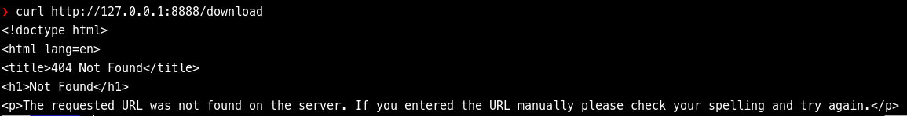

# Part 2 – Serving a File (Download Route)

I've showed how to create a minimal  __Flask__ server that serves a route. I'll expand on this by serving a file for download. For the OSWE course, several of the Proof of Concept (PoC) exploit scripts have required serving a file or two as part of the exploit chain. 

We’ll build a small, runnable example first, then discuss behavior and trade-offs. 

---

## Minimal Download Server (single route)

Create `download_server.py`:

```python
from pathlib import Path
from flask import Flask, send_file, abort

app = Flask(__name__)

PAYLOAD_PATH = Path("payload.bin")
ROUTE = "/download"  # In later parts we'll randomize this for stealth

@app.route(ROUTE, methods=["GET"])
def handle_download():
    if not PAYLOAD_PATH.exists():
        abort(404)

    return send_file(PAYLOAD_PATH, as_attachment=True)

if __name__ == "__main__":
    app.run(host="127.0.0.1", port=8888, debug=False)

```

In the directory where `download_server.py` is, create or copy a file to `payload.bin`. The file can be any type; for this example its contents don’t matter.. When `download_server.py` is started, **Flask** will bind to localhost or `127.0.0.1` on port `8888`. The point is simply to serve payload.bin when /download is requested with GET. The route decorator takes care of setting the route as I showed in the first part of this article series. In addition, one can define/restrict which `HTTP Verbs` are valid for a given route. I'm restricting `/download` to only serve the file if using `HTTP GET`. If someone would try a POST request, they'd receive a `405 Method Not Allowed` error.

Unlike Python's `http.server` module, with `Flask`, the end user can control what content is visible and actionable. If I put more files in the directory, they will be effectively unavailable to prying eyes.

To create `payload.bin`, I simply used `echo` to insert text into the file (`echo 'Download Server Test' >> payload.bin`). Then, from a terminal start the download server:
```bash
python3 download_server.py
```

To retrieve the file, one can use the `curl` command as shown below.

  

What is going on under the hood, is that I've made a `GET` request to the `download` route. The `PAYLOAD_PATH` is tested to see if the file exists. If `/download` is requested, but `payload.bin` isn't present or readable by the **Flask** server, a 404 error will be returned. You can try this by renaming or moving payload.bin.



I've moved payload.bin back and `PAYLOAD_PATH.exists()` will be `True` which allows the program to flow to `return send_file(PAYLOAD_PATH, as_attachment=True)`. `send_file` will send the file contents to the client. Setting `as_attachment=True` tells the browser, for example, to save the file instead of displaying it. The default is to set `as_attachment` to `False`. I could also set the __MIME__ type to say `application/pdf` or `image/jpeg` if needed. `send_file` will try to determine the __MIME__ type from the filename. If the payload is ambiguous, one may want to set this to `mimetype="application/octet-stream"`.

Example:
```python
return send_file(PAYLOAD_PATH, as_attachment=True, mimetype="application/octet-stream")
```

Now that we can deliver a payload reliably, the next step is to accept file uploads.