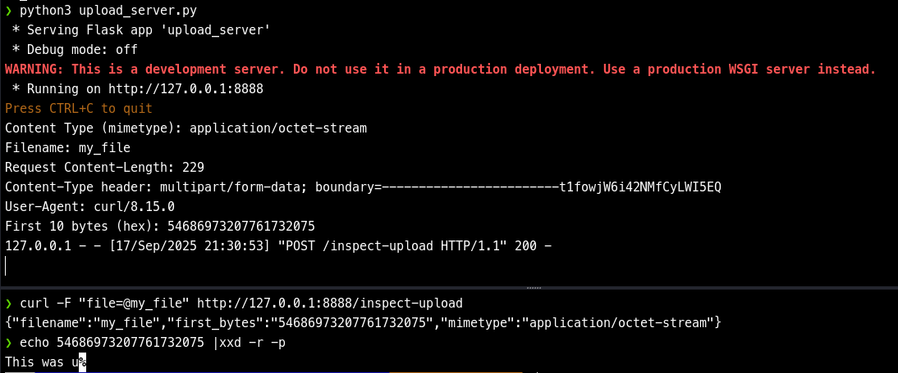

# Part 3 – Accepting Uploads (multipart/form-data)

## Goals
- Implement a POST route to accept `multipart/form-data` uploads.
- Save artifacts with predictable naming in a target directory.

## What You’ll Build
- `/upload` route that accepts one file field and persists it safely.

## Sections
- **Route Contract:** Validate presence of file → sanitize filename → save → return JSON summary.
- **Storage Layout:** Where to store (`save_dir`), naming patterns, collisions.
- **Security Considerations:** Don’t trust client filenames; avoid path traversal; size limits (conceptually).
- **Milestone:** curl POST works; file appears on disk with expected name.
- **Troubleshooting:** Missing `Content-Type`, wrong form field name, empty files.


```python
from pathlib import Path
from flask import Flask, request, abort
from werkzeug.utils import secure_filename

app = Flask(__name__)

UPLOAD_FILE = "my_file"
UPLOAD_DIRECTORY="./upload2"
ROUTE="/upload"

Path(UPLOAD_DIRECTORY).mkdir(parents=True, exist_ok=True)

@app.route(ROUTE, methods=["POST"])
def handle_upload():
    if "file" not in request.files:
        abort(400, description="No file part in request")

    file = request.files["file"]

    if file.filename == "":
        abort(400, description="No file selected")
	
    filename = secure_filename(file.filename)
    save_path = Path(UPLOAD_DIRECTORY) / filename
    file.save(save_path)
	
    return { "status": "sucess", "result": f"{filename} saved to {save_path}"}, 200

if __name__ == "__main__":
    app.run(host="127.0.0.1", port=8888, debug=False)

```

As a slight aside, the `files` property is an immutable dictionary-like object from the `Werkzeug Library`. It's dictionary-like due to the object handling multiple values for the same key. So, under the hood, you would have something like the following:

```python
from werkzeug.datastructures import ImmutableMultiDict
form_data = ImmutableMultiDict([('filename','my_file'),('filename', 'another_file'), ('foo', 'bar')]) 
print(form_data.get('filename'))
print(form_data.getlist('filename'))
```

From a REPL:
```python
>>> print(form_data.get('filename'))
my_file
>>> print(form_data.getlist('filename'))
['my_file', 'another_file']
```

[Werkzeug FileStorage ](https://werkzeug.palletsprojects.com/en/stable/datastructures/#werkzeug.datastructures.FileStorage)

```python
@app.route("/inspect-upload", methods=["POST"])
def inspect_upload():
    if "file" not in request.files:
        abort(400, "No file in request")

    f = request.files["file"]  # Werkzeug FileStorage 

    # Basic metadata
    content_type = f.mimetype            
    filename = f.filename
    content_length = request.content_length  

    first_bytes = f.stream.read(10)
    try:
        f.stream.seek(0)
    except (AttributeError, OSError):
        pass

    # Pick a few useful headers instead of dumping everything
    content_type_header = request.headers.get("Content-Type")
    user_agent = request.headers.get("User-Agent", "<none>")

    # Log/print (avoid in production — here for teaching/debugging)
    print(f"Content Type (mimetype): {content_type}")
    print(f"Filename: {filename}")
    print(f"Request Content-Length: {content_length}")
    print(f"Content-Type header: {content_type_header}")
    print(f"User-Agent: {user_agent}")
    print(f"First 10 bytes (hex): {first_bytes.hex() if first_bytes else '<empty>'}")

    return {
        "filename": filename,
        "mimetype": content_type,
        "first_bytes": first_bytes.hex() if first_bytes else None
    }, 200

```

```bash
curl -F "file=@my_file" http://127.0.0.1:8888/inspect-upload
```



If you wanted to accept all files, you could change `file = ... return ...` to something like this:

```python

saved = []
for field_name, file in request.files.items():
    if file.filename:
        filename = secure_filename(file.filename)
        save_path = Path(UPLOAD_DIRECTORY) / filename
        file.save(save_path)
        saved.append({"field": field_name, "filename": filename})

return {"status": "success", "result": saved}, 200
```

```bash
curl -F "file=@payload.bin" http://127.0.0.1:8888/upload
```

```bash
curl -F "foo=@payload.bin" http://127.0.0.1:8888/upload
```

```bash
curl -F "alpha=@test1.txt" -F "beta=@test2.txt" http://127.0.0.1:8888/upload
```
## Exercises
- Upload multiple file types; verify extensions and sizes.
- Upload same filename twice; decide overwrite vs versioning.

## What’s Next
- Base64-encoded exfil via query/body for hostile transports.